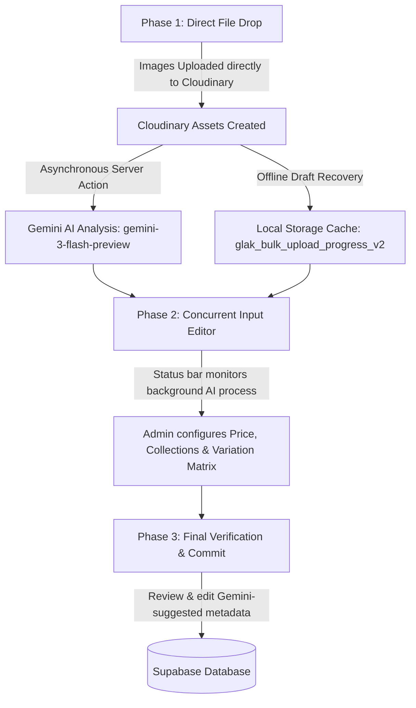

# 📐 GLak Tienda — Architecture & Features Specification

This document provides a highly detailed specification of the architecture, data flows, routing, and critical features of the GLak Tienda e-commerce platform. It is based on the comprehensive codebase audit, serving as the blueprint for current implementation and future extensions.

---

## 📁 1. Next.js Routing & Folder Structure

GLak Tienda is built on **Next.js 16.2.3 (App Router)** and **React 19.2.4**, using organized route groups to cleanly segregate the customer-facing storefront from the administration panel.

### Visual Architecture Hierarchy
```
src/
├── app/
│   ├── (admin)/               # Route Group: Administrative Panel
│   │   ├── admin/
│   │   │   ├── categorias/    # Category Administration
│   │   │   ├── clientes/      # Customer Directory
│   │   │   ├── configuracion/ # Platform Configurations
│   │   │   ├── contenido/     # CMS & Editorial Banners
│   │   │   ├── pedidos/       # Order Tracking & Fulfillment
│   │   │   └── productos/     # Inventory & Catalog Management
│   │   │       ├── carga-masiva/  # Gemini AI bulk uploader
│   │   │       ├── crear/     # Single manual creation form
│   │   │       ├── editar/    # Dynamic edit forms
│   │   │       │   └── [id]/  # Route segment for specific product ID
│   │   │       ├── actions.ts # Server Actions (Mutations & DB writes)
│   │   │       └── geminiActions.ts # Server Actions for Gemini Analysis
│   │   └── layout.tsx         # Admin sidebar and desktop layout
│   └── (store)/               # Route Group: Customer Public Storefront
│       ├── checkout/          # Purchase flow checkout page
│       ├── contacto/          # Customer service channels
│       ├── favoritos/         # Customer wishlists
│       ├── mi-cuenta/         # User profile and order history
│       ├── politicas/         # Legal & shipping disclosures
│       ├── producto/          # Product Detail Pages (PDP)
│       │   └── [slug]/        # Dynamic slug-based product routing
│       ├── talles/            # Interactive sizing charts
│       ├── tienda/            # Main products catalog & filters
│       ├── layout.tsx         # Floating header, cart wrapper, and footer
│       └── page.tsx           # High-fashion editorial landing page
```

### Route Design Philosophy
* **Route Groups (`(admin)` and `(store)`)**: Used to separate layouts and middleware requirements without affecting the URL structure.
* **Layout Isolation**: 
  * The `(admin)` group provides a persistence sidebar on desktop and bottom navigation on mobile to maximize workspace utility.
  * The `(store)` group provides a premium, immersive consumer layout featuring a floating glassmorphic navbar and slide-out cart drawer.

---

## 🛒 2. State Management: Zustand Shopping Cart (`cartStore.ts`)

Cart operations are entirely centralized in a persistent Zustand store (`src/stores/cartStore.ts`) powered by **Zustand 5.0.12**.

### Technical Highlights
1. **Dynamic LocalStorage Persistence**:
   Uses the Zustand `persist` middleware to synchronize cart items in the user's browser under the storage key `'glak-cart'`.
2. **Selective Hydration (Partialize)**:
   Avoids persisting ephemeral UI states (such as `isOpen` for the slide-out drawer) to keep the localStorage footprint clean and lightweight.
   ```typescript
   partialize: (state) => ({ items: state.items })
   ```
3. **Reactive Threshold Calculations**:
   Exposes dynamic selectors (getters) for instant cart computations:
   * `totalItems`: Cumulative quantity of products in cart.
   * `totalPrice`: Final monetary sum of all items in Argentine Pesos (ARS).
   * `freeShippingThreshold`: Dynamic progress tracker showing the remaining amount required to qualify for free shipping (configured at `$25.000` ARS).

### Cart Store Schema Definition
```typescript
interface CartItem {
  id: string;
  slug: string;
  name: string;
  price: number;
  image: string;
  color: {
    id: string;
    name: string;
    hex: string;
  };
  size: string;
  quantity: number;
}

interface CartState {
  items: CartItem[];
  isOpen: boolean;
  
  // Actions
  addItem: (item: Omit<CartItem, 'quantity'>, quantity?: number) => void;
  removeItem: (itemId: string, colorId: string, size: string) => void;
  updateQuantity: (itemId: string, colorId: string, size: string, quantity: number) => void;
  clearCart: () => void;
  setIsOpen: (isOpen: boolean) => void;
  
  // Dynamic Selectors
  getTotalItems: () => number;
  getTotalPrice: () => number;
  getShippingProgress: () => {
    progress: number; // 0 to 100 percentage
    remaining: number; // ARS remaining
  };
}
```

---

## 🖼️ 3. Cloudinary Integration & Responsive Layouts

To ensure premium performance at edge-level speeds without standard bulky library footprints, the application utilizes a highly custom, lightweight Cloudinary utility pipeline.

### A. Lightweight Asset Optimization (`src/lib/cloudinary/utils.ts`)
Instead of loading runtime Cloudinary SDK scripts, GLak Tienda uses an in-house URL compilation script that:
* **Enforces Automatic Format (`f_auto`)**: Directs Cloudinary to serve the most modern format supported by the request browser (e.g., **AVIF** for Chrome/Safari, **WebP** as a fallback).
* **Enforces Quality Optimization (`q_auto`)**: Automatically balances compression algorithms, providing visual fidelity at minimum byte sizes.
* **Exposes dynamic `srcSet` generation**: Generates screen-density-aware URLs (e.g., widths of 400px, 800px, 1200px) so devices download only what they can display.
* **Blur-Up Lazy Loading**: Compiles miniature, heavily blurred base64 visual placeholders (`cloudinaryBlurPlaceholder`) that load instantly, preventing layout shifts (CLS) and optimizing Largest Contentful Paint (LCP).

### B. Responsive Layout & Mobile-First Design
GLak Tienda balances desktop power with optimized handheld control:
* **Mobile Layouts**: Native bottom tab bars (`BottomNav` for customers and `AdminBottomNav` for administrators) place navigation directly under thumbs. Cart drawers (`CartDrawer`) slide up or in with smooth spring physics.
* **Desktop Grid**: Standard sidebars (`AdminSidebar`) take over wider layouts, accompanied by a dynamic fluid typography grid using CSS `clamp()` equations:
  * Text scales fluidly based on screen width:
    `--text-base: clamp(0.875rem, 0.825rem + 0.25vw, 1rem)`
    `--text-5xl: clamp(2.25rem, 1.75rem + 2.5vw, 3rem)`
* **Liquid Glass & Zero-JS Micro-Animations**:
  * CSS-native hardware-accelerated translucent filters: `backdrop-filter: blur(16px)` for premium UI surfaces.
  * Scroll-driven entry reveals using CSS Scroll Timelines (`animation-timeline: view()`) without blocking the main JS thread. Fallbacks are integrated via `@supports`.

---

## 🤖 4. Google Gemini 3-Flash Multimodal Catalog Uploader

The platform features a state-of-the-art catalog entry interface that uses AI to automate inventory population.

### The 3-Phase Bulk Uploading Workflow
Located in `/admin/productos/carga-masiva`, the mass uploader splits the complex ingestion pipeline into three distinct visual phases:



#### Phase 1: Upload & Trigger
1. The administrator drops raw product image files into the upload component.
2. The client uploads the images directly to the secure Cloudinary endpoint using the `'GlakTienda'` unsigned preset.
3. Once the Cloudinary URL is resolved, the client triggers the server action:
   `analyzeProductWithAI(imageUrl)` (defined in `geminiActions.ts`).
4. **Draft Recovery**: The client immediately saves the file names and upload states in `localStorage` under `glak_bulk_upload_progress_v2` to prevent data loss on browser crashes or network drops.

#### Phase 2: Concurrent Editing
1. While the Google Gemini model analyzes the images asynchronously, the administrator does not have to wait.
2. The user interface displays a sticky status tracking bar that reports the percentage of active Gemini runs.
3. Concurrently, the administrator can assign prices, set collections, and define variation matrices (colors, sizes, stocks) using the custom dynamic `ColorSizesSection` component.

#### Phase 3: Verification & Commit
1. Once Gemini completes its processing, it populates the drafts with AI-generated metadata.
2. The administrator performs a visual walkthrough, reviewing and modifying the AI's predictions:
   * **Name**: Elegant, commercial product title.
   * **Category**: Standardized tag fitting store filters.
   * **Description**: Copy detailing styling, fabric composition, and premium attributes.
   * **Tags**: Search-optimized keywords.
3. The administrator hits "Guardar en Base de Datos" (Save to Database), bulk-inserting the new records into Supabase.

### Gemini AI Technical Integration
The AI server action is powered by `@google/genai` (v`1.50.1`) targeting the **`gemini-3-flash-preview`** model.

```typescript
// Core conceptual flow inside src/app/(admin)/admin/productos/geminiActions.ts
import { GoogleGenAI } from '@google/genai';

const ai = new GoogleGenAI({ apiKey: process.env.GEMINI_API_KEY });

export async function analyzeProductWithAI(imageUrl: string) {
  try {
    // 1. Fetch image binary buffer from Cloudinary URL on the Server
    const imageResponse = await fetch(imageUrl);
    const imageBuffer = await imageResponse.arrayBuffer();
    
    // 2. Format payload for Gemini
    const imagePart = {
      inlineData: {
        data: Buffer.from(imageBuffer).toString('base64'),
        mimeType: 'image/jpeg'
      }
    };
    
    // 3. Execute prompt requesting strict structural JSON schema
    const response = await ai.models.generateContent({
      model: 'gemini-3-flash-preview',
      contents: [
        imagePart,
        `Eres un catalogador experto de moda italiana de alta gama para la boutique 'GLak Tienda'.
         Analiza detalladamente esta prenda de vestir y genera la información del producto.
         Debes responder ÚNICAMENTE con un objeto JSON estructurado con la siguiente forma:
         {
           "name": "Título premium del producto en español",
           "category": "Una de las siguientes: Vestidos, Camisas, Pantalones, Blusas, Accesorios, Abrigos",
           "description": "Una descripción editorial descriptiva y elegante, resaltando material, fit y estilo",
           "tags": ["3-5 tags de búsqueda relevantes"]
         }`
      ]
    });
    
    const text = response.text || '';
    // Clean and return the parsed JSON result to the client form
    return JSON.parse(text.substring(text.indexOf('{'), text.lastIndexOf('}') + 1));
  } catch (error) {
    console.error("Gemini Ingestion Pipeline Error:", error);
    return null;
  }
}
```

---

## 📋 5. Summary of Architecture Recommendations

To transition this state-of-the-art catalog into a secure, enterprise-grade production platform, the following measures are scheduled:

1. **Security RLS Reinforcement**: Replace open policies in `supabase_products_schema.sql` with authenticated administrative claims:
   ```sql
   CREATE POLICY "Allow write operations to admins only" 
   ON public.products FOR ALL TO authenticated 
   USING (auth.jwt() ->> 'role' = 'service_role' OR (auth.jwt() -> 'user_metadata' ->> 'is_admin')::boolean = true);
   ```
2. **Build-Time Compilation Safety**: Set `ignoreBuildErrors: false` in `next.config.ts` and resolve all TypeScript interface warnings.
3. **SEO Link Optimization**: Replace raw client anchors (`<a>`) with `<Link>` inside `ProductCard.tsx` to enable continuous client-side SPA routing and retain Zustand memory contexts.
4. **Dynamic Metadata Filtering**: Transition filter sidebars from static categories to live database joins, keeping tienda views in perfect sync with the administrative catalog.
