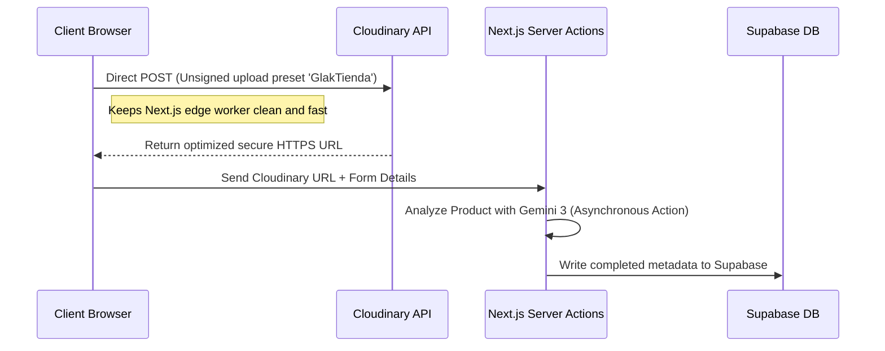

# 🎯 Plan Perfection: Architecting Resilient Features & Integrations

This skill defines the technical planning, risk-mitigation, and system-design protocols for GLak Tienda's edge-first architecture. It guarantees that all new modules are planned for maximum security, edge-compatible efficiency, and optimal UX resilience under real-world conditions.

---

## 🛠️ 1. Next.js 16 App Router & Route Group Architecture

When planning any new feature, developers must align with the Next.js 16 App Router paradigm and the existing structure of GLak Tienda:

### Route Segmentation Design
All routes must reside within their respective Next.js Route Groups to enforce separation of concerns:
*   **(store)**: User-facing public storefront routes (`/tienda`, `/producto/[slug]`, `/talles`, etc.). These pages must be designed for instant initial render times, fluid page transitions, dynamic SEO, and responsive mobile-first displays.
*   **(admin)**: Private administrative panels (`/admin/productos`, `/admin/pedidos`, `/admin/productos/carga-masiva`, etc.). These handle heavy CRUD actions, AI auto-population interfaces, and variation editors.

### Routing Execution Rules
*   **SPA Integrity**: Never use raw `<a>` anchors for internal application routing. They trigger a full window reload, which discards in-memory states (like Zustand's non-persisted properties or active search query buffers) and triggers redundant API fetches. All internal navigation must use the Next.js `Link` component from `next/link`.
*   **Root Layout Cleanliness**: Font declarations (Outfit, Inter, Playfair Display) and primary SEO metadata definitions must remain in the root layout (`src/app/layout.tsx`). Avoid replicating global elements in route group layouts.

---

## ⚡ 2. Edge Compatibility & Cloudflare OpenNext Deployments

GLak Tienda is deployed as a Serverless Worker on the Cloudflare edge network via `@opennextjs/cloudflare` and configured using `wrangler.jsonc`. Edge runtimes have strict execution constraints that must be accounted for during the planning phase.

### Edge Worker Constraints Checklist
1.  **Cold Start Optimization**: Minimize direct dependencies inside edge code. Avoid massive third-party packages (e.g., heavy Cloudinary SDKs); use clean REST requests or lightweight utility builders instead (refer to [utils.ts](file:///c:/Users/thiag/Desktop/Files/Projects/Glak%20Tienda/GLak%20Tienda%20Web/glak-tienda/src/lib/cloudinary/utils.ts)).
2.  **No Node.js Native Globals**: Ensure that any library chosen does not depend on native Node.js APIs (like `fs`, `dns`, or `child_process`) that are unavailable in pure V8/Cloudflare Worker environments.
3.  **ISR & Caching Setup**: To optimize page loads, GLak Tienda binds an R2 bucket (`glak-isr-cache`) for Incremental Static Regeneration caching.
    *   *Rule*: Dynamic routes that depend on external data (like product details or categories) must employ strategic Next.js caching directives (e.g., `revalidate` intervals) to ensure they are updated cleanly at the edge without putting constant loads on Supabase.

---

## 🔒 3. Supabase Schema & Row-Level Security (RLS) Planning

All database mutations and schema designs must follow secure protocols to prevent public manipulation of catalog assets.

### Complete Schema Integration
Every database modification must be detailed in the SQL schema. The standard `supabase_products_schema.sql` file must fully map:
*   `products` table (with standard metadata, slug, and active status).
*   `colors` table (with hex strings, custom titles, and RLS rules).
*   `collections` table (for seasonal highlights and grouped inventories).
*   `product_collections` (junction table coordinating relations between products and collections).

### Zero-Trust RLS Policies
Never rely on wide-open anonymous policies (like the development-only `"Allow all updates during development" ON public.products FOR ALL USING (true)`).
*   **Public Access**: Read-only operations (`SELECT`) are allowed for the public on active products and categories.
*   **Admin Mutations**: `INSERT`, `UPDATE`, and `DELETE` actions must be guarded by strict checking:
    ```sql
    -- Example secure admin restriction
    CREATE POLICY "Allow admin write operations"
    ON public.products 
    FOR ALL
    TO authenticated
    USING (auth.uid() IN (SELECT id FROM public.admin_users))
    WITH CHECK (auth.uid() IN (SELECT id FROM public.admin_users));
    ```

---

## 🖼️ 4. Direct Cloudinary Asset Upload Planning

To keep edge workers fast and clean, GLak Tienda executes high-resolution media uploads directly from the browser, bypassing the server.

### The Client-to-Cloudinary Protocol


### Upload Performance Standards
*   **Direct Uploads**: The browser uploads directly to the Cloudinary API using the designated `'GlakTienda'` unsigned preset.
*   **Next.js Server Role**: The server only processes the returned Cloudinary URLs for catalog creation and metadata extraction, preventing memory spikes inside the Edge worker.

---

## 🤖 5. Google Gemini Multimodal Catalog Pipeline

GLak Tienda integrates the `@google/genai` library with the `gemini-3-flash-preview` model inside server actions to automate backend categorization and catalog tagging.

### Asynchronous Pipeline Design (e.g., Bulk Uploader)
When planning AI-assisted bulk uploads, implement the 3-phase concurrent pipeline:
1.  **Phase 1 (Asset Upload & AI Trigger)**: The browser triggers direct Cloudinary uploads. As each upload completes, the client fires an asynchronous Server Action (`analyzeProductWithAI`) in the background. The current layout progress is cached in `localStorage` (`glak_bulk_upload_progress_v2`) to prevent data loss.
2.  **Phase 2 (Concurrent Form Editing)**: While Gemini analyzes the visual buffers, the administrator must be able to concurrently edit basic fields (price, select collections, write stock variation matrices) on the page.
3.  **Phase 3 (Review & Commit)**: The AI-generated names, descriptions, tags, and categories are returned, displayed for final editorial adjustments, and committed as a single structured transaction to Supabase.

### Resiliency & Rate Limiting
*   **Base64 Conversion**: Fetch the Cloudinary assets on the server side and convert them into base64 inline parts (`image/jpeg` or `image/png`) to pass safely to Gemini's API.
*   **Fail-safe Mechanism**: If the Gemini API fails or times out, the uploader must gracefully fall back to a manual empty form without breaking the UI flow. Always preserve the administrator's custom inputs.
